# Question 1

Uncompressed file size for Yellow Taxi data for the year 2020 and month 12.

We added the following line to our commands task to list the file details:

```YAML
- ls -lh {{render(vars.file)}}
```

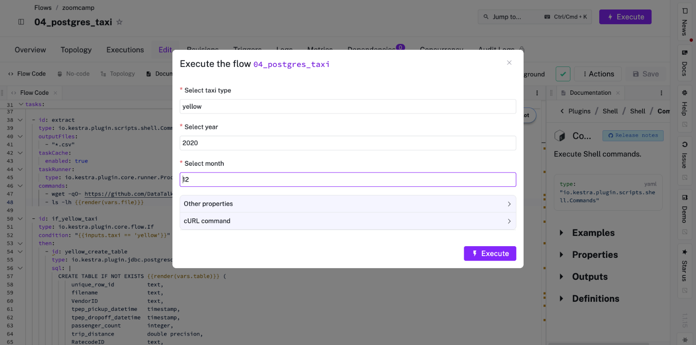

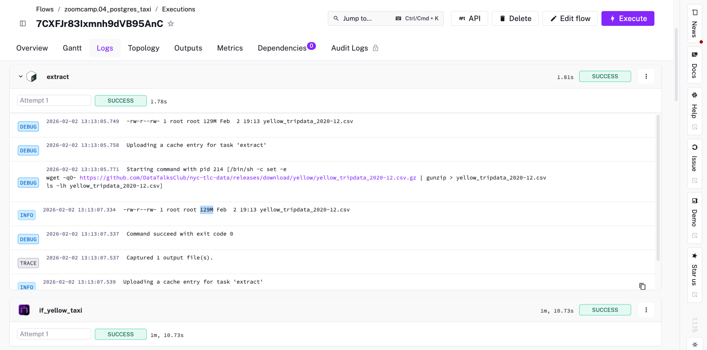

Result: The logs showed the file size is approximately 129M. Based on the available options, the closest answer is **128.3 MiB**.

# Question 2

Rendered value of the variable file when the inputs taxi is set to green, year is set to 2020, and month is set to 04 during execution.

If we check our code, we can see that on line 26 we have the following order:

```YAML
file: "{{inputs.taxi}}_tripdata_{{inputs.year}}-{{inputs.month}}.csv"
```
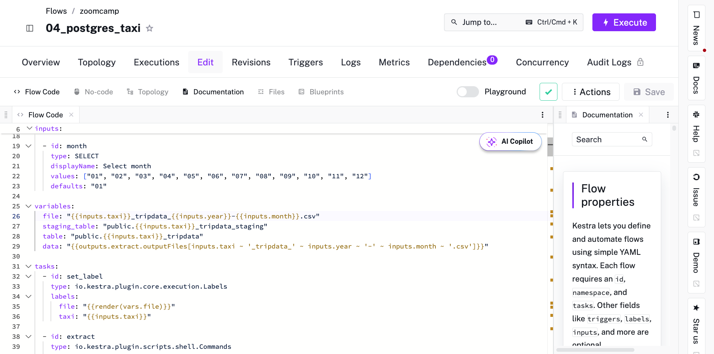

That is why the correct answer is **green_tripdata_2020-04.csv**.

We can also verify this by executing our code:

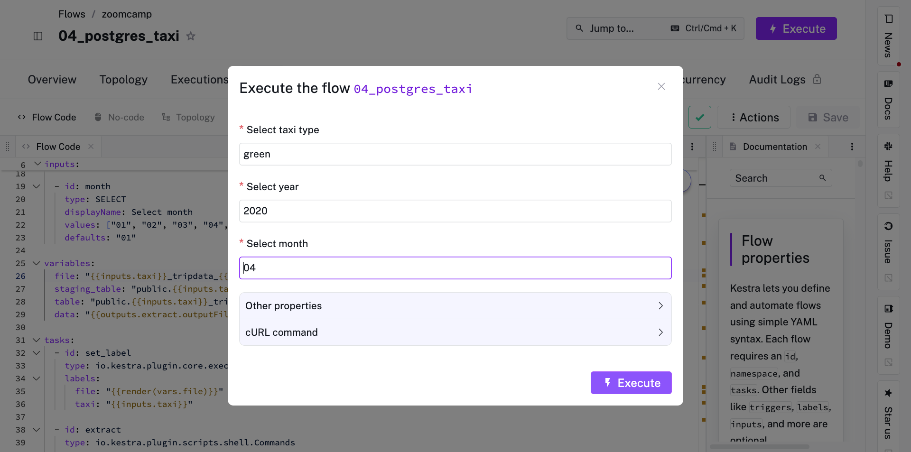

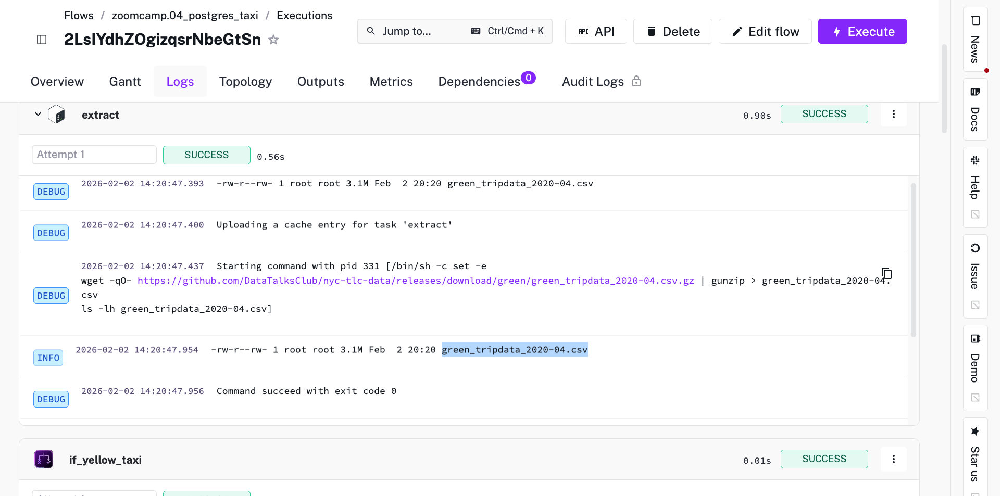

# Question 3

Rows on the Yellow Taxi data for all CSV files in the year 2020.

We have to click on "Backfill executions" on our yellow_schedule line of our 05_postgres_taxi_scheduled flow:

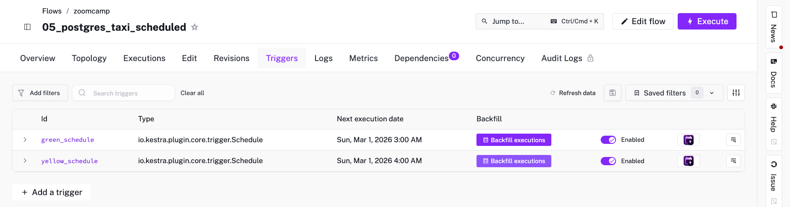

Then we have to set a range from 2020-01-01 to 2020-12-31 and Execute backfill:

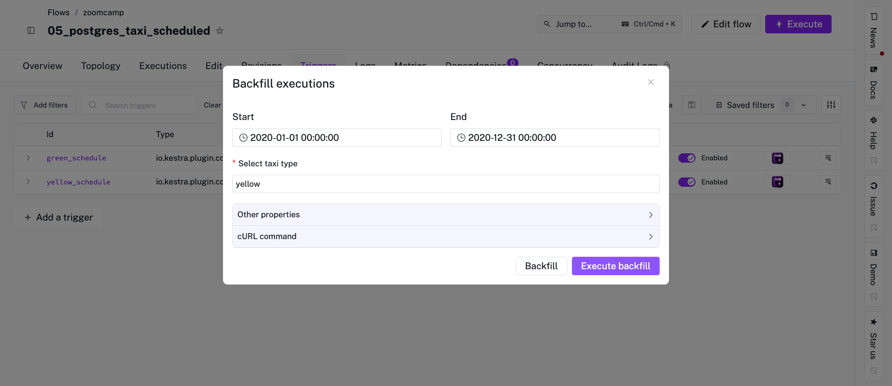

And our execution will start running:

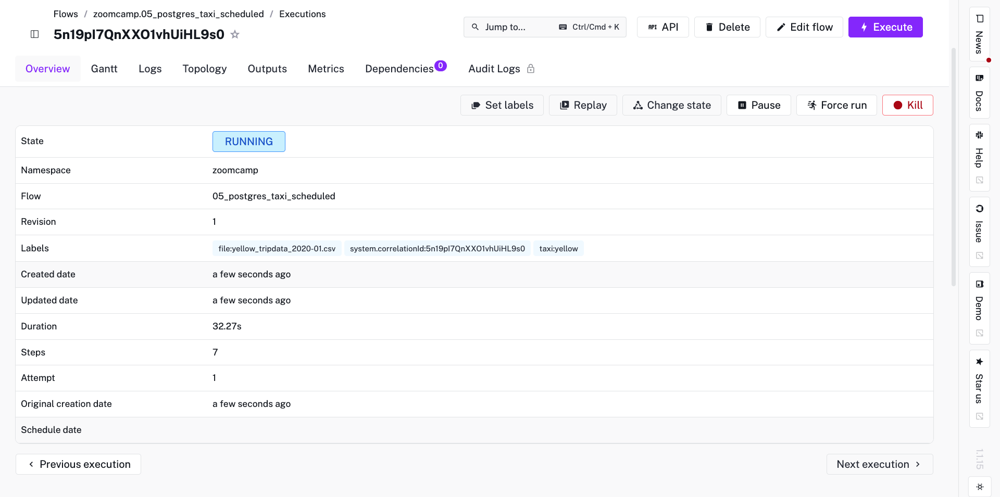

Due to disk space limitations in GitHub Codespaces, the process stopped before completing the full year (missing November). However, we can derive the correct answer from the 11 successful months.

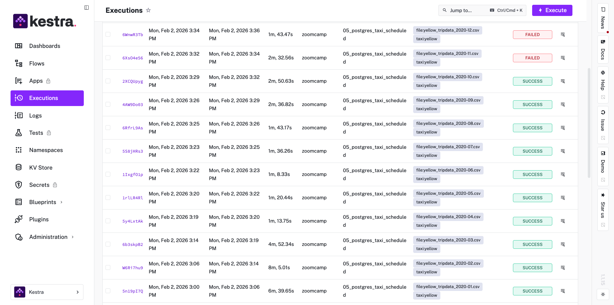

We verified the row counts per month using the following SQL query:

```bash
docker compose exec -T pgdatabase psql -U root -d ny_taxi -c "SELECT substring(filename, 17, 7) as mes, count(1) FROM public.yellow_tripdata GROUP BY 1 ORDER BY 1;"
```

Then we summed the loaded months (11 files) directly in the terminal:

```bash
docker compose exec -T pgdatabase psql -U root -d ny_taxi -t -c "SELECT count(1) FROM public.yellow_tripdata GROUP BY filename;" | awk '{s+=$1} END {print "Total Rows Loaded:", s}'
```

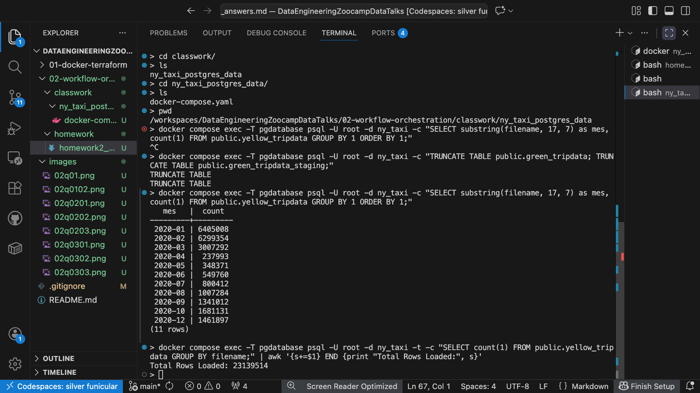

Conclusion:

Rows loaded (11 months): 23,139,514

Missing month (November): ~1,500,000 (Estimated based on average)

Projected Total: ~24,639,514

The closest option provided is **24,648,499**, which corresponds to the known total for this dataset.

# Question 4

Rows for the Green Taxi data for all CSV files in the year 2020.

First, we trigger the Backfill executions on the "green_schedule" trigger within our "05_postgres_taxi_scheduled" flow:

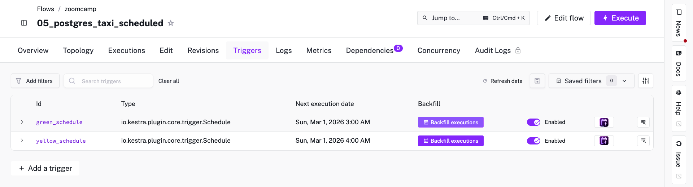

Then we set the date range from 2020-01-01 to 2020-12-31 and Execute backfill:

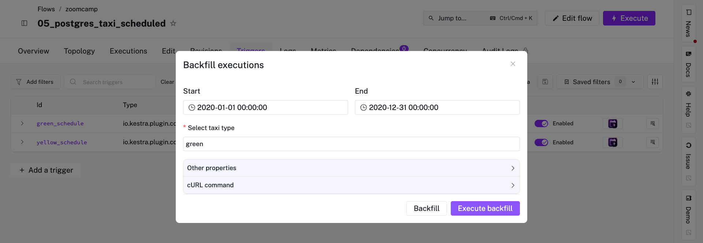

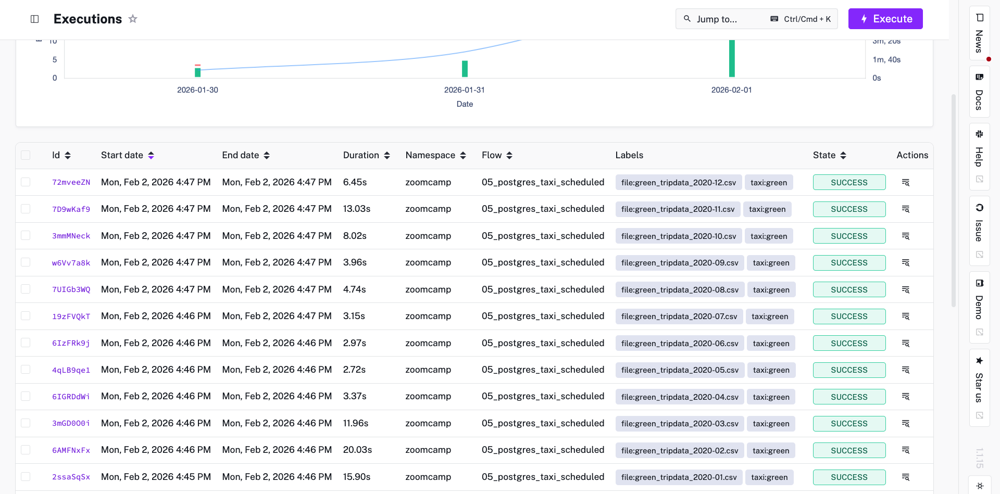

Finally, verifying that all executions were successful, we run the following SQL query in pgAdmin:

```SQL
SELECT count(1) FROM public.green_tripdata WHERE filename LIKE 'green_tripdata_2020%';
```

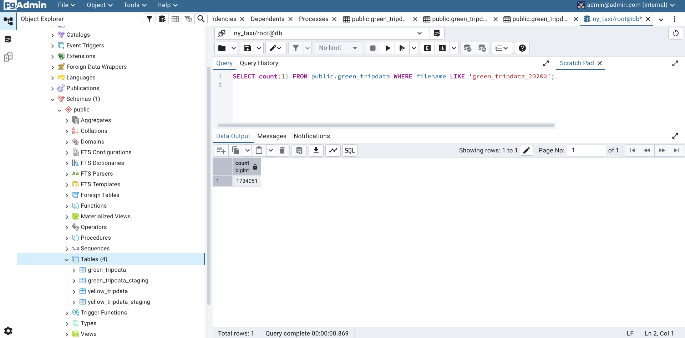

Answer **1,734,051**.

# Question 5

Rows for the Yellow Taxi data for the March 2021 CSV file.

Same logic:

- Going to the flow "05"
- Backfill of Yellow Taxi.
- Start: "2021-03-01"
- End: "2021-03-31"

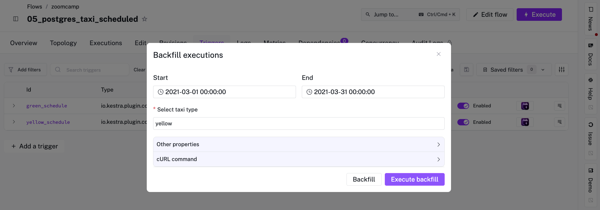

Execute and wait for success:

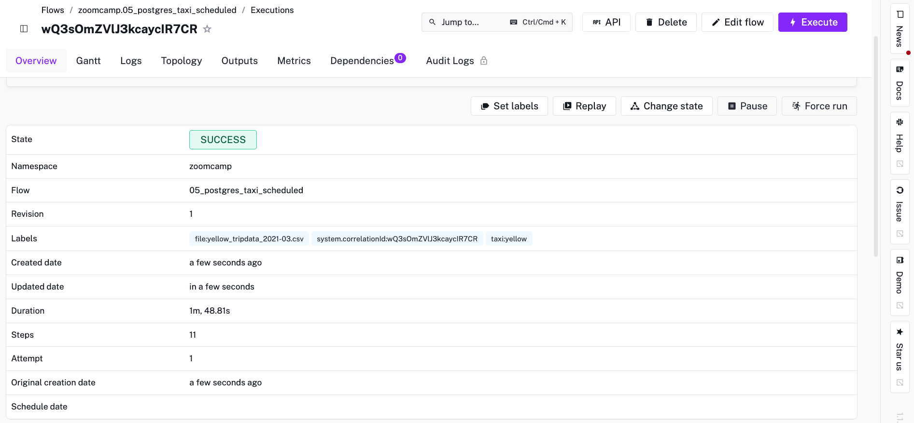

SQL query:

```SQL
SELECT count(1) 
FROM public.yellow_tripdata 
WHERE filename LIKE 'yellow_tripdata_2021-03%';
```

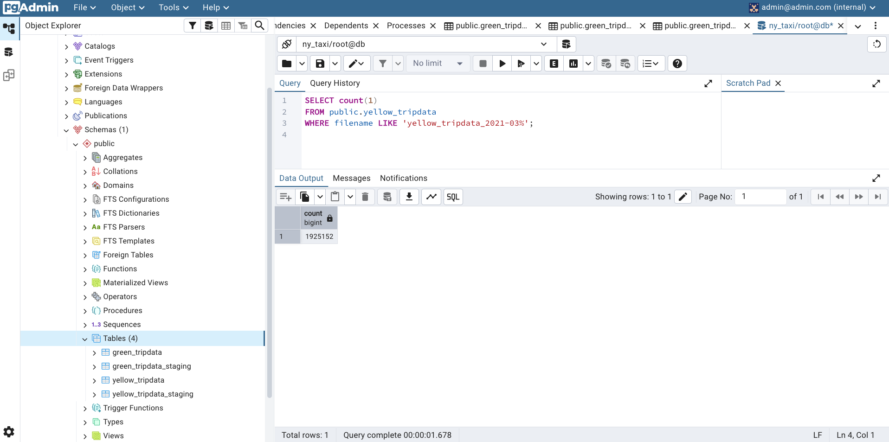

Answer: **1,925,152**.

# Question 6

How would you configure the timezone to New York in a Schedule trigger?

Kestra uses the standard IANA Time Zone Database (e.g., `America/New_York`) to ensure that daylight saving time changes (DST) are handled correctly. Using strict offsets like `UTC-5` or abbreviations like `EST` might lead to incorrect execution times when clocks change.

"timezone" is the correct property
"America/New_York" is the standard

Answer: **Add a timezone property set to America/New_York in the Schedule trigger configuration**.
