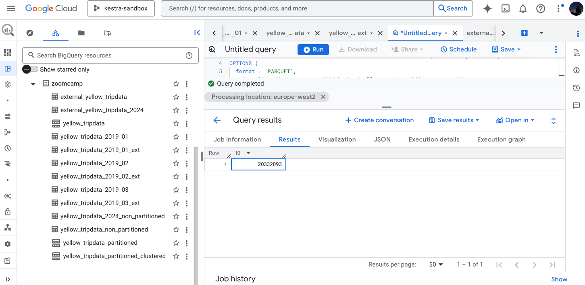
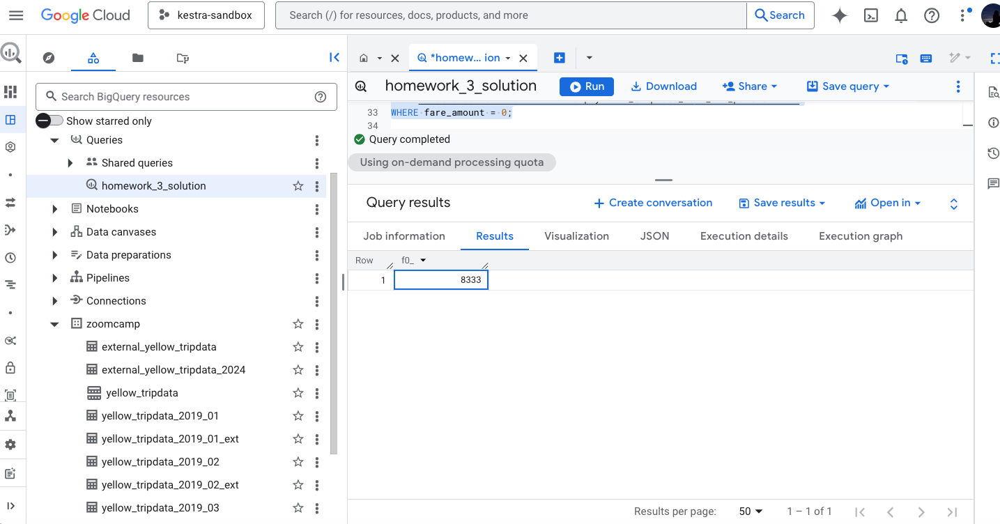
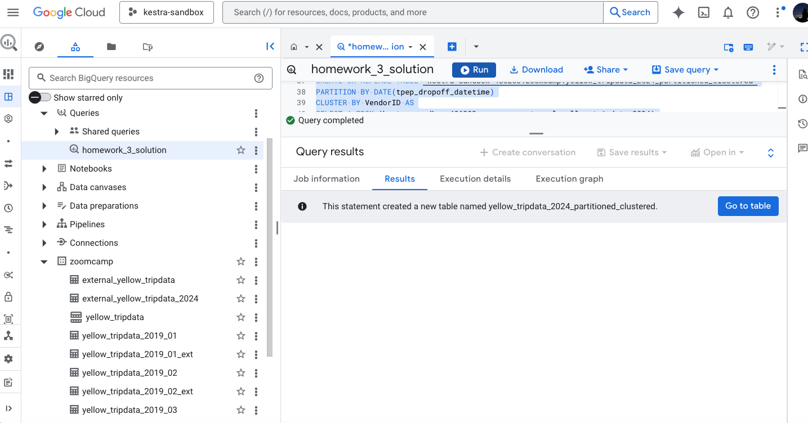
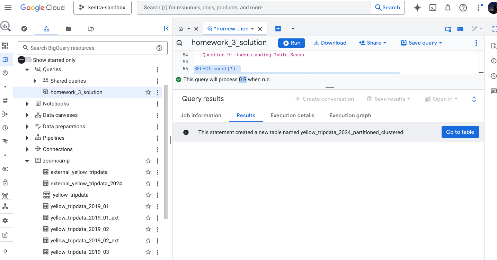

# Module 3 Homework: Data Warehousing & BigQuery

## Loading the data

We will use the Python script to load the data into Google Cloud Storage (GCS) manually, bypassing the orchestrator (Kestra) as required by the homework instructions.

## BigQuery Setup

### Preparing the Python Script

First, upload the `load_yellow_taxi_data.py` script to the Codespace. We need to modify it to use our specific Bucket and Environment Authentication.

Changes required:
1.  Update the `BUCKET_NAME` variable to match your GCS bucket.
2.  Comment out the lines that attempt to create the bucket (since it already exists).
3.  Switch authentication from JSON file to the terminal environment.

We won't use the gcs.json file, we will make the authentication on the terminal.

**Code modifications:**

Comment out the JSON credentials:

```Python
# CREDENTIALS_FILE = "gcs.json"
# client = storage.Client.from_service_account_json(CREDENTIALS_FILE)
```

And uncomment the environment client:

```Python
client = storage.Client()
```

### Installing Google Cloud SDK

We have to execute the following commands separetely in the terminal:

```Bash
curl -O https://dl.google.com/dl/cloudsdk/channels/rapid/downloads/google-cloud-cli-linux-x86_64.tar.gz
```

```Bash
tar -xf google-cloud-cli-linux-x86_64.tar.gz
```

```Bash
./google-cloud-sdk/install.sh --quiet
```

```Bash
source ./google-cloud-sdk/path.bash.inc
```

### Installing Python Dependencies

The necessary libraries to run the script:

```Bash
pip install google-cloud-storage pandas pyarrow fastparquet
```

### Personal login

Authenticate the session so the script can access GCS:

```Bash
gcloud auth login --no-launch-browser
```
Copy the link -> paste it in our browser -> authorize -> copy the code -> ppaste it in the terminal

Application Default Login (for the script):

```Bash
gcloud auth application-default login --no-launch-browser
```
Same process of link and code

### Project Configuration

```Bash
gcloud config set project <YOUR_PROJECT_ID>
```

### Loading the data

Run the script to download the 2024 Yellow Taxi data and upload it to your Bucket:

```Bash
python load_yellow_taxi_data.py
```

If successful, the parquet files will be visible in your GCS Bucket.

# Question 1. Counting records

Count of records for the 2024 Yellow Taxi Data.

We have to open a new query tab in the BigQuery console and execute the following SQL commands:

```SQL
-- 1. Create the external table using parquet files from GCS
CREATE OR REPLACE EXTERNAL TABLE `<YOUR_PROJECT_ID>.zoomcamp.external_yellow_tripdata_2024`
OPTIONS (
  format = 'PARQUET',
  uris = ['gs://<YOUR_BUCKET_NAME>/yellow_tripdata_2024-*.parquet']
);

-- 2. Create the materialized table (Native BigQuery Table)
CREATE OR REPLACE TABLE `<YOUR_PROJECT_ID>.zoomcamp.yellow_tripdata_2024_non_partitioned` AS
SELECT * FROM `<YOUR_PROJECT_ID>.zoomcamp.external_yellow_tripdata_2024`;

-- 3. Counting records
SELECT count(*) FROM `<YOUR_PROJECT_ID>.zoomcamp.yellow_tripdata_2024_non_partitioned`;
```


Answer: **20332093**

# Question 2: Data Read Estimation

Estimated amount of data that will be read when this query is executed on the External Table and the Table.

We have to write a query to count the distinct number of PULocationIDs for the entire dataset on both tables.

```sql
-- Query for External Table
SELECT COUNT(DISTINCT PULocationID)
FROM `<YOUR_PROJECT_ID>.zoomcamp.external_yellow_tripdata_2024`;
```
Preview: This query will process 0 B when run.

```sql
-- Query for Materialized Table
SELECT COUNT(DISTINCT PULocationID)
FROM `<YOUR_PROJECT_ID>.zoomcamp.yellow_tripdata_2024_non_partitioned`;
```
Preview: This query will process 155.12 MB when run.

Answer: **0 MB for the External Table and 155.12 MB for the Materialized Table**.

# Question 3. Understanding columnar storage

Why are the estimated number of Bytes different? 

Query to retrieve the PULocationID from the table (not the external table) in BigQuery.

```sql
-- Query 1: Retrieving one column
SELECT PULocationID 
FROM `<YOUR_PROJECT_ID>.zoomcamp.yellow_tripdata_2024_non_partitioned`;
```

Query to retrieve the PULocationID and DOLocationID on the same table.

```sql
-- Query 2: Retrieving two columns
SELECT PULocationID, DOLocationID
FROM `<YOUR_PROJECT_ID>.zoomcamp.yellow_tripdata_2024_non_partitioned`;
```

Answwer: **BigQuery is a columnar database, and it only scans the specific columns requested in the query. Querying two columns (PULocationID, DOLocationID) requires reading more data than querying one column (PULocationID), leading to a higher estimated number of bytes processed.**

Why?

* Reading 1 column = X bytes.
* Reading 2 columns = X bytes + Y bytes.

# Question 4: Counting Zero Fare Trips

How many records have a fare_amount of 0?

We will use the following query:

```sql
SELECT count(*) 
FROM `<YOUR_PROJECT_ID>.zoomcamp.yellow_tripdata_2024_non_partitioned`
WHERE fare_amount = 0;
```


Answer: **8,333**.

# Question 5. Partitioning and clustering

The best strategy to make an optimized table in Big Query if your query will always filter based on tpep_dropoff_datetime and order the results by VendorID is **Partition by tpep_dropoff_datetime and Cluster on VendorID**

Explanation:

Partitioning by `tpep_dropoff_datetime` allows BigQuery to perform **partition pruning**. When we filter by date using the `WHERE` clause, BigQuery skips scanning partitions that don't match the filter, significantly reducing cost and time.

Clustering by `VendorID` sorts the data within each partition. Since the query requires ordering the results by `VendorID`, having the data pre-sorted (collocated) minimizes the computational cost of the `ORDER BY` operation.

To create a new table with this strategy we will use the following query:

```sql
CREATE OR REPLACE TABLE `<YOUR_PROJECT_ID>.zoomcamp.yellow_tripdata_2024_partitioned_clustered`
PARTITION BY DATE(tpep_dropoff_datetime)
CLUSTER BY VendorID AS
SELECT * FROM `<YOUR_PROJECT_ID>.zoomcamp.external_yellow_tripdata_2024`;
```



# Question 6. Partition benefits

Write a query to retrieve the distinct VendorIDs between tpep_dropoff_datetime 2024-03-01 and 2024-03-15 (inclusive)

```sql
-- Query for non-partitioned table
SELECT DISTINCT VendorID
FROM `<YOUR_PROJECT_ID>.zoomcamp.yellow_tripdata_2024_non_partitioned`
WHERE tpep_dropoff_datetime BETWEEN '2024-03-01' AND '2024-03-15';
```
Preview: This query will process 310.24 MB when run.

```sql
-- Query for partitioned table
SELECT DISTINCT VendorID
FROM `<YOUR_PROJECT_ID>.zoomcamp.yellow_tripdata_2024_partitioned_clustered`
WHERE tpep_dropoff_datetime BETWEEN '2024-03-01' AND '2024-03-15';
```
Preview: This query will process 26.84 MB when run.

Answer: **310.24 MB for non-partitioned table and 26.84 MB for the partitioned table**.

# Question 7: External Table Storage

Where is the data stored in the External Table you created?

Answer: **GCP Bucket**.

Explanation: An external table creates a link to the data stored outside of BigQuery. In this case, our table points directly to the Parquet files stored in the Google Cloud Storage (GCP) Bucket.

# Question 8: Clustering Best Practices

It is best practice in Big Query to always cluster your data.

Answer: **False**

Explanation: Clustering is not recommended for small tables (typically under 1 GB). According to the course notes, for small datasets, clustering and partitioning do not improve performance and can actually add significant cost due to metadata reads and maintenance overhead.

# Question 9: Understanding Table Scans

Write a `SELECT count(*)` query FROM the materialized table you created. How many bytes does it estimate will be read? Why?

```sql
SELECT count(*) 
FROM `<YOUR_PROJECT_ID>.zoomcamp.yellow_tripdata_2024_non_partitioned`;
```



Explanation: BigQuery stores the total number of rows in the table's metadata. When you run a SELECT count(*) without any filters, BigQuery retrieves this value directly from the metadata instead of scanning the actual data rows, resulting in 0 bytes processed.
