# Module 4 Homework: Analytics Engineering with dbt

## Setup & Data Ingestion

### Step 1: Project Setup

The initial dbt project setup was already completed during the class modules by following the official local setup guide. The environment is configured using DuckDB as the local data warehouse and dbt Core.

### Step 2: Loading NYC Taxi Data

To fulfill the homework requirements, the local `ingest.py` script was modified to dynamically download and convert specific years of data for different vehicle types from the official DataTalksClub repository:

- Green and Yellow Taxi Data: 2019 and 2020
- For-Hire Vehicles (FHV): 2019 only

Modifications to `ingest.py`:

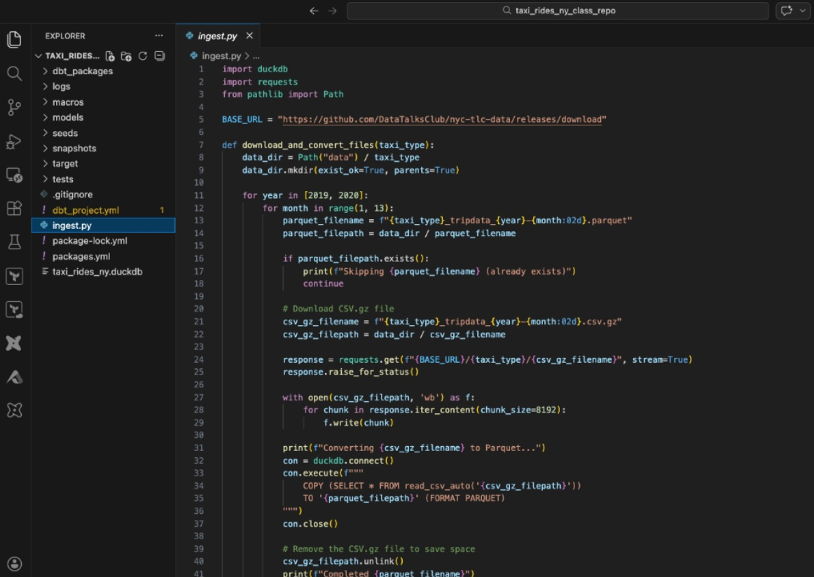
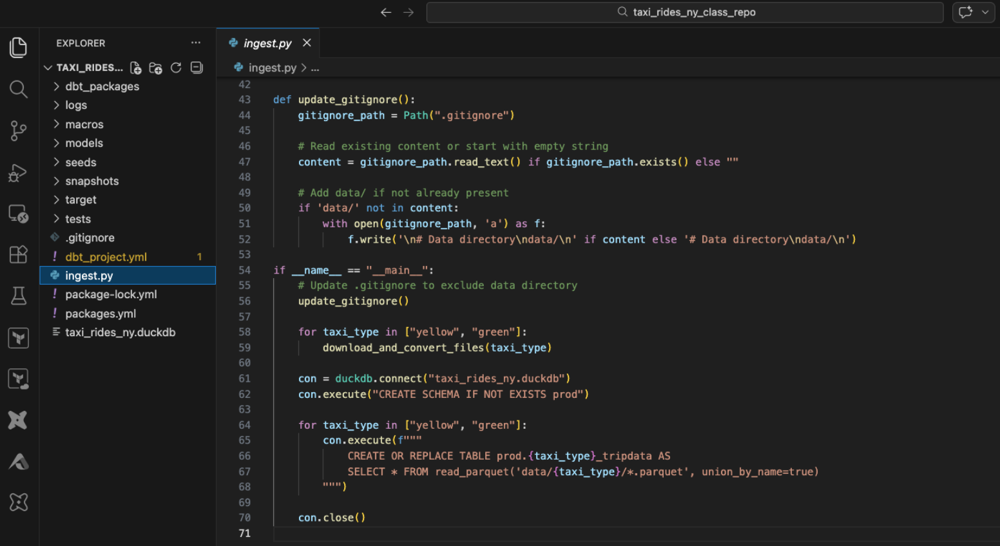

1. Added flexibility to the download function by passing a `years` list argument.

Instead of having fixed years, we will pass the specific years to the function.

So we change the line:

```python
def download_and_convert_files(taxi_type):
```

To:

```python
def download_and_convert_files(taxi_type, years):
```

And the line:

```python
for year in [2019, 2020]:
```

To:

```python
for year in years:
```

2. Specified the exact downloads needed for each taxi type.

We delete the block for taxi_type in ["yellow", "green"]: and replace it with these three specific lines:

```python
download_and_convert_files("yellow", [2019, 2020])
download_and_convert_files("green", [2019, 2020])
download_and_convert_files("fhv", [2019])
```

3. Included the `fhv` dataset in the table creation loop inside the `prod` schema.

Then we created tables in the correct schema including FHV

We change from:

```python
for taxi_type in ["yellow", "green"]:
```

To:

```python
for taxi_type in ["yellow", "green", "fhv"]:
```

4. Then we save and execute the script.

```Bash
python ingest.py
```

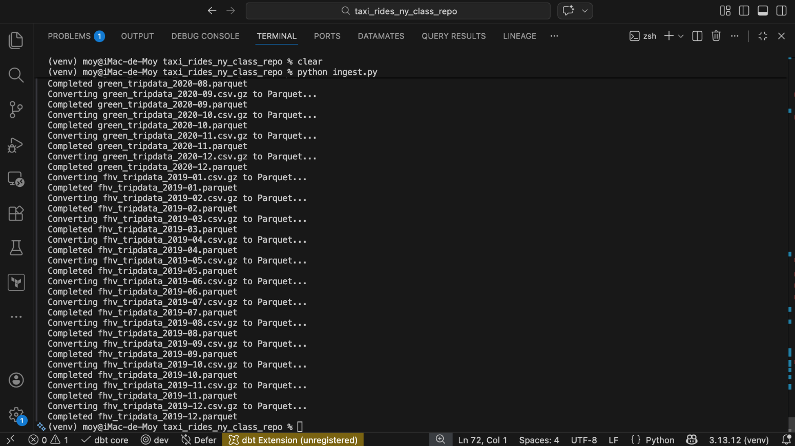

### Step 3: Building the Production Models

Before building the models, the ~/.dbt/profiles.yml file was updated to set the memory_limit to '8GB' for the prod target. This ensures DuckDB has enough RAM to process the heavy data transformations and prevents Out of Memory (OOM) errors.

Finally, all models, seeds, and tests were built and run in the production dataset using the following command:

```Bash
dbt build --target prod
```

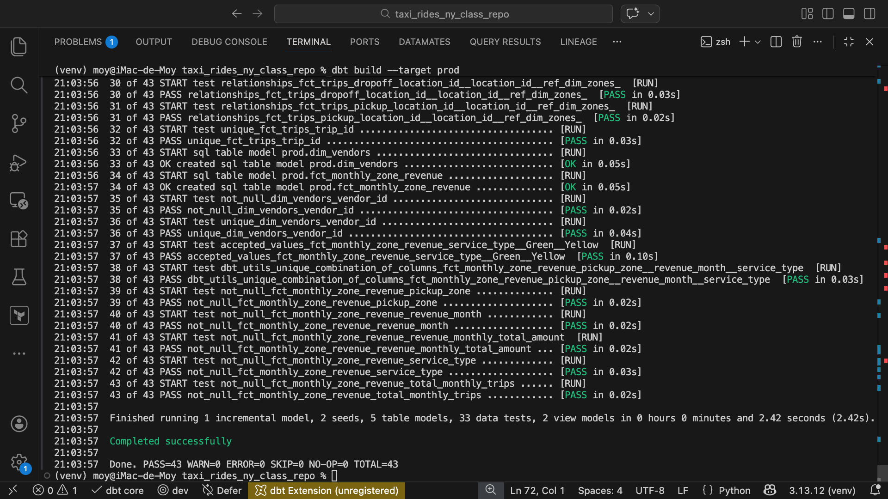

## Question 1: dbt Lineage and Execution

Answer: **int_trips_unioned only**.

Explanation:

The command dbt run --select int_trips_unioned uses the selection syntax without any graph operators (like +). By default, dbt strictly executes the model specified in the argument. To build upstream dependencies (staging models), we would need to run dbt run --select +int_trips_unioned. To build downstream dependencies, we would use int_trips_unioned+. Since neither is present, only the intermediate model is built.

In dbt, the `--select` flag followed by a model name will only execute that specific model. To execute upstream dependencies (parents), the `+` operator must be placed before the model name (e.g., `+int_trips_unioned`). To execute downstream dependencies (children), the `+` operator must be placed after the model name (e.g., `int_trips_unioned+`). Since no operators were used, dbt isolates and runs only the specified model.

## Question 2: dbt Tests

Question: You've configured a generic test for `accepted_values` with values `[1, 2, 3, 4, 5]` on a column. Your model runs successfully for months, but a new value `6` appears in the source data. What happens when you run `dbt test --select fct_trips`?

Answer: **dbt will fail the test, returning a non-zero exit code**.

Explanation: In dbt, tests are compiled into SQL `SELECT` statements designed to return failing records (records that violate the defined assertion). Since the value `6` is not in the list of `accepted_values`, the compiled query will return the rows containing this new value. By default, if a test query returns any records, dbt interprets this as a failure, halts the process, and returns a non-zero exit code. It will not silently pass, skip the test, or auto-update the configuration.

The accepted_values test is designed to validate that column values fall strictly within the provided list. When the value 6 appears in the source data, it violates the assertion [1, 2, 3, 4, 5]. By default, dbt tests are configured with a severity of error. Therefore, dbt identifies the failing records and terminates the process with a failure status (non-zero exit code), alerting the engineer to the data quality issue.

## Question 3. Counting Records in fct_monthly_zone_revenue

After running your dbt project, query the fct_monthly_zone_revenue model. What is the count of records in the fct_monthly_zone_revenue model?

**Answer: 12,184**

### The Journey and Architectural Evolution

Getting to this answer wasn't just a matter of running a single command; it required evolving the entire data architecture to handle the scale of the NYC Taxi dataset. Here is the documentation of the troubleshooting and engineering process.

#### Phase 1: The Local Bottleneck (dbt Core + DuckDB)

Initially, the approach was to use a fully local setup with dbt Core and DuckDB running on an iMac.

* The Problem: Processing millions of rows locally quickly consumed all available RAM, causing the machine to freeze and the processes to crash.

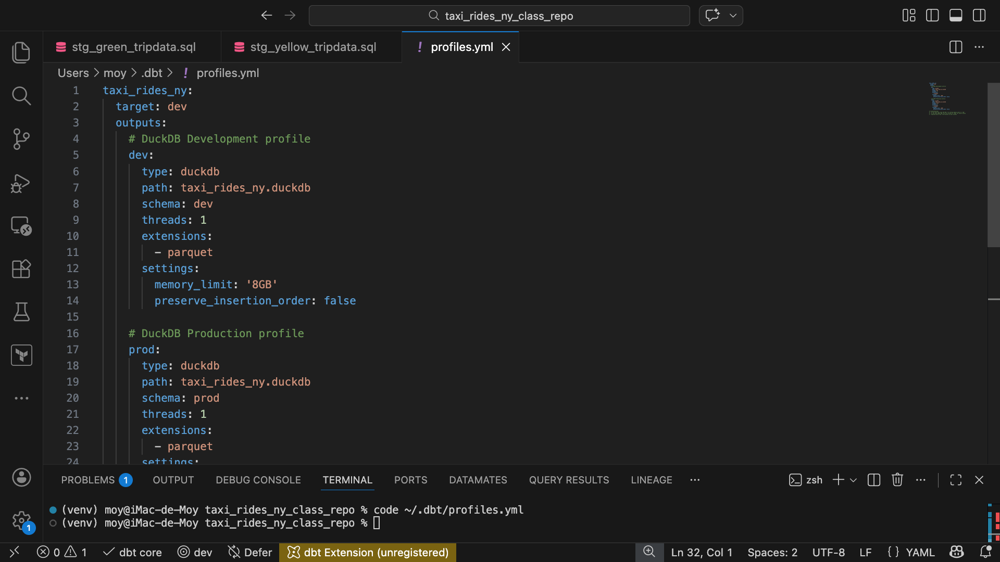
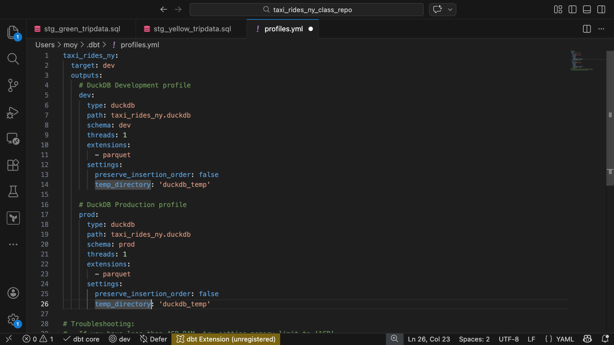
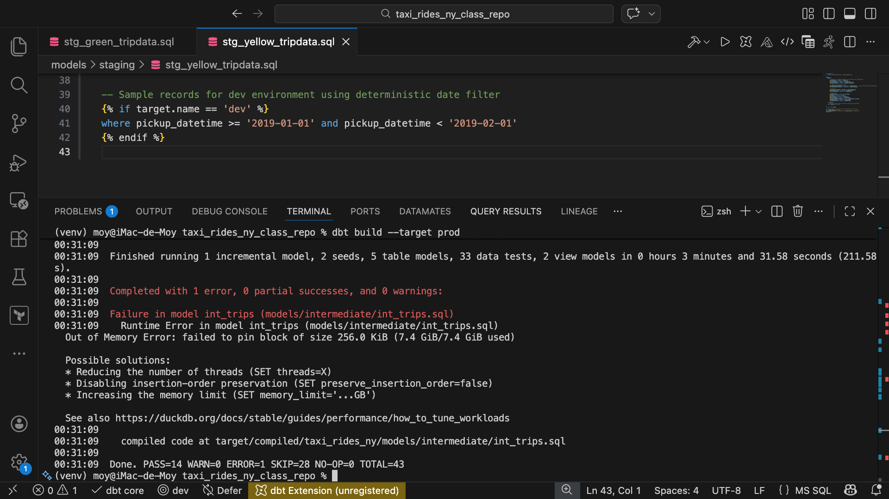

* The Solution: A pivot to a Hybrid Architecture. The EL (Extract & Load) pipeline would remain orchestrated by Kestra, but the T (Transform) phase would be decoupled. dbt Core would remain local to write and compile code, while the heavy lifting of data processing was delegated to Google Cloud BigQuery.

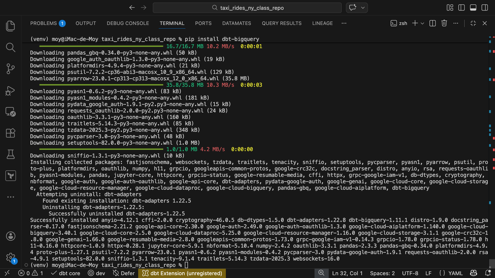
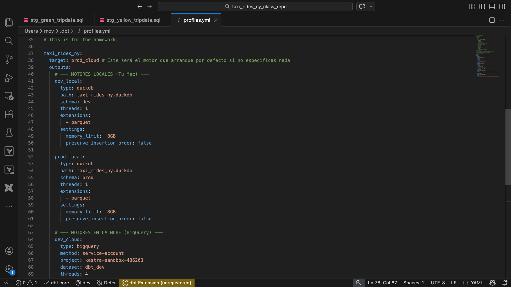
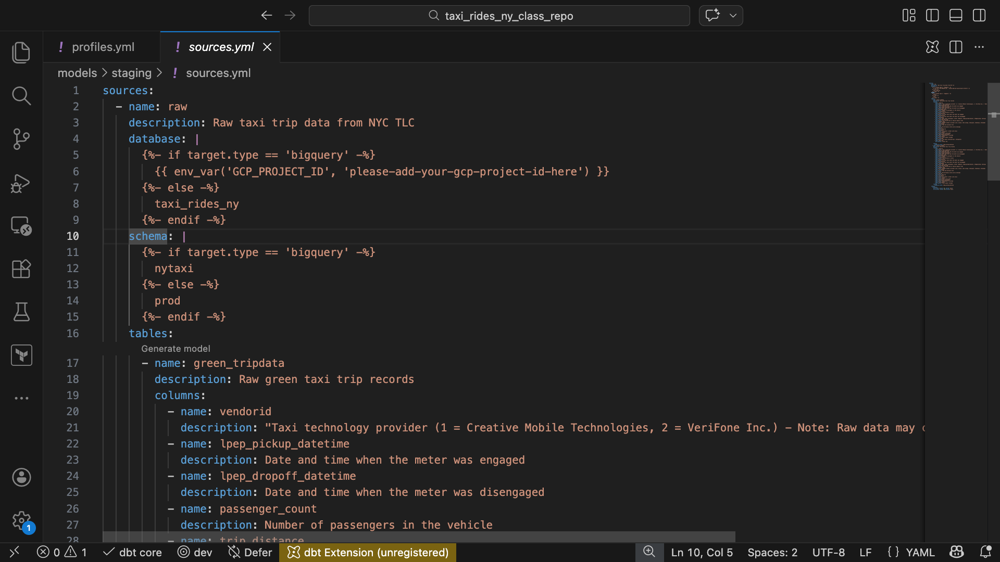
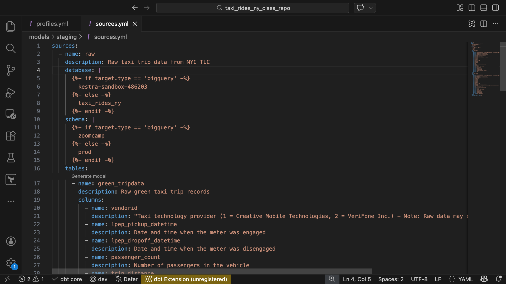
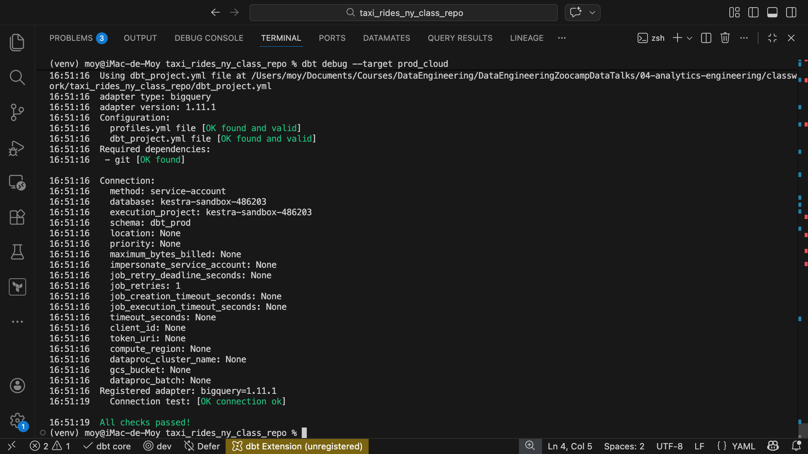
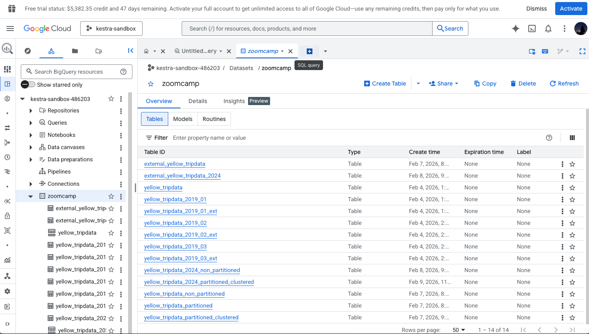
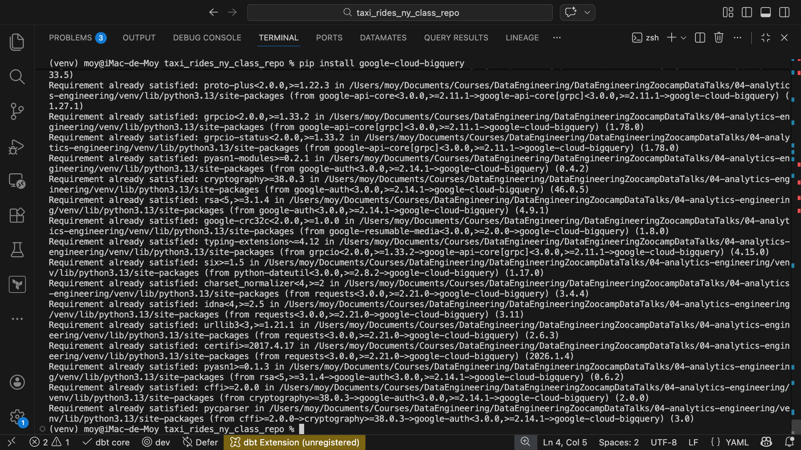

#### Phase 2: Extract & Load Crisis (Kestra & Codespaces Storage)

To load the raw data into GCP, a Kestra instance was deployed inside a GitHub Codespace.

* The Problem (Disk Space Exhaustion): The backfill execution for 2019-2020 data kept failing. The 32GB Codespace disk hit 100% capacity rapidly. This happened because Kestra was downloading multiple large `.csv.gz` files concurrently, but the upload tasks to Google Cloud Storage (GCS) were failing (due to missing/unlinked `GCP_CREDS` in the KV Store). Without successful uploads, Kestra couldn't trigger the `purge_files` task, leaving gigabytes of temporary files trapped in the Docker volumes.

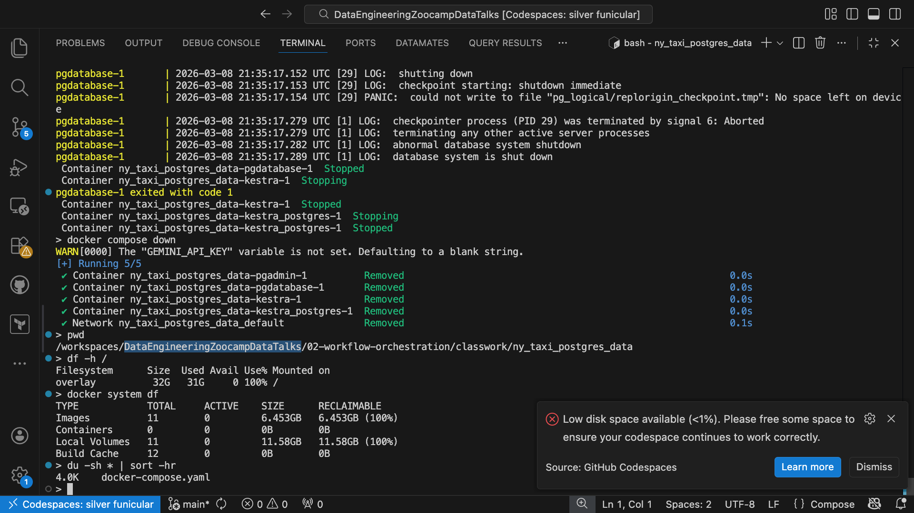

* The Solution:

1. Purged the corrupted Docker volumes to free up space:

```bash
docker compose down
docker volume rm ny_taxi_postgres_data_kestra_data
docker compose up -d

```

2. Fixed the `GCP_CREDS` JSON string in Kestra's KV Store.

3. Concurrency Control: Modified the flow to process sequentially, preventing the disk from overflowing:

```yaml
concurrency:
  limit: 2 # Prevents parallel downloads from exhausting the 32GB disk

```

4. Fixed the dynamic file routing to explicitly reference the physical file in Kestra's internal storage:

```yaml
from: "{{ outputs.extract.outputFiles[render(vars.file)] }}"

```

#### Phase 3: Transformation (dbt Core + BigQuery Region Wars)

With the raw data safely in BigQuery (`zoomcamp` dataset), it was time to run the transformation models.

* The Problem 1 (Data Limits): Running a simple `dbt build` resulted in a surprisingly low row count (only 79 rows). This was due to the default `is_test_run: true` variable in the staging models, which hard-limited the data to 100 rows for testing purposes.

* The Problem 2 (Cross-Region Denial): When attempting to build the models, BigQuery threw a `Not found: Dataset <project-id>:dbt_prod was not found in location europe-west2` error. In the first attempt, dbt defaulted to the `US` multi-region and created the `dbt_prod` dataset there. However, the raw data was loaded by Kestra into `europe-west2`. GCP strictly forbids cross-region data queries.

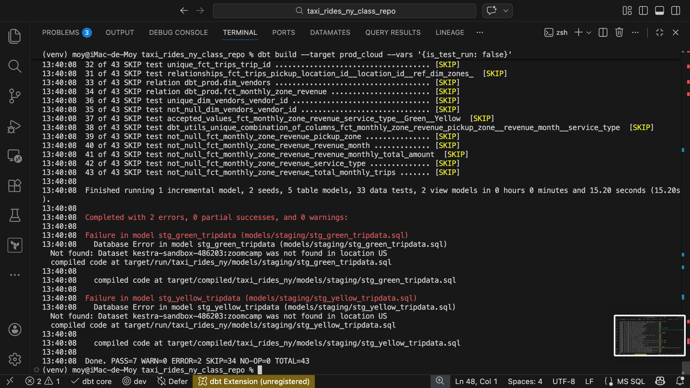

* The Solution:

1. Deleted the incorrectly located dataset via the GCP Console.
2. Updated the local `profiles.yml` to explicitly declare the correct location mapping:

```yaml
prod_cloud:
  type: bigquery
  method: service-account
  project: <your-gcp-project-id>
  dataset: dbt_prod
  threads: 4
  keyfile: '<path-to-your-service-account-json>'
  location: europe-west2 # Critical fix to match the raw data region

```

3. Pre-created the `dbt_prod` dataset in `europe-west2` manually to avoid GCP automated creation permission blocks.

4. Executed the final build command, passing the parameter to disable the 100-row test limit:

```bash
dbt build --target prod_cloud --vars '{is_test_run: false}'

```

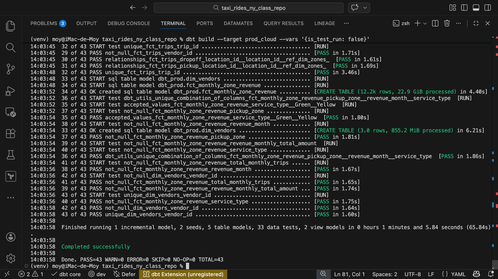
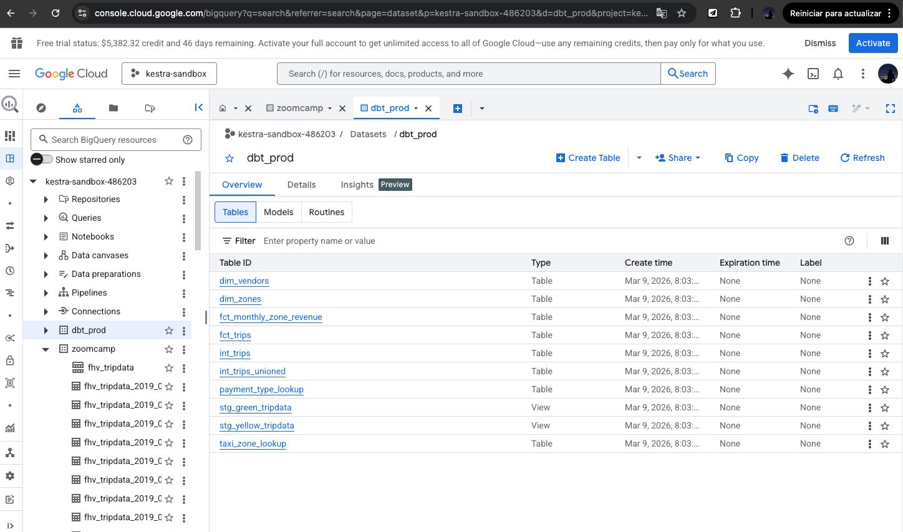

#### Phase 4: The Final Query

Once the `dbt build` completed successfully, compiling all staging, core, and mart models in the cloud, the final query was executed directly in the BigQuery SQL workspace:

```sql
SELECT count(*)
FROM `<your-gcp-project-id>.dbt_prod.fct_monthly_zone_revenue`;

```

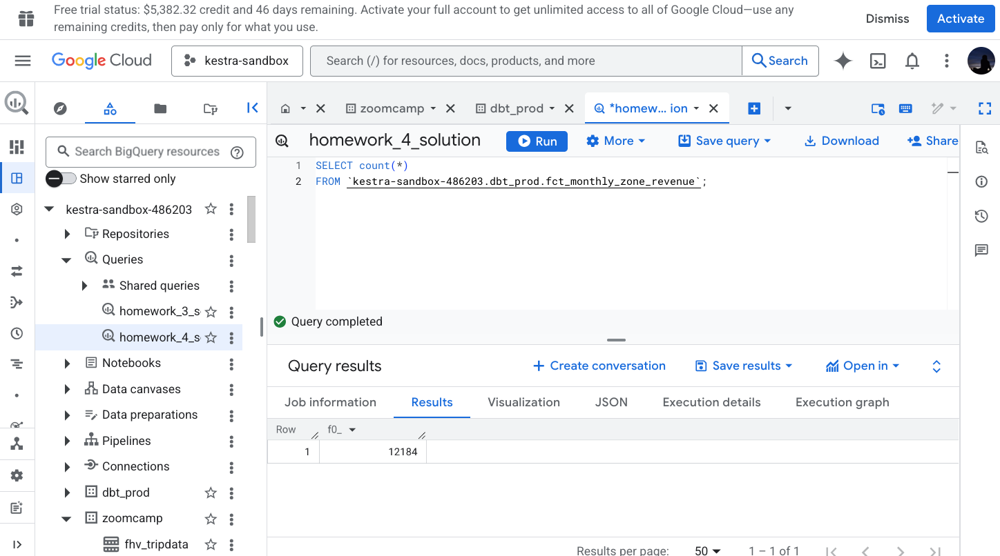
**Result:** `12184`

## Question 4. Best Performing Zone for Green Taxis (2020)

Answer: **East Harlem North**

### Methodology

To find the best performing pickup zone for Green taxis in 2020, I queried the newly materialized `fct_monthly_zone_revenue` table directly in BigQuery. 

Since the table contains monthly aggregations, the data needed to be filtered specifically for the 'Green' `service_type` and the year 2020. Then, the revenue was summed across all months of that year and grouped by `revenue_zone` to find the highest earner.

The following SQL query was executed:

```sql
SELECT 
  pickup_zone,
  SUM(revenue_monthly_total_amount) AS total_revenue
FROM `kestra-sandbox-486203.dbt_prod.fct_monthly_zone_revenue`
WHERE service_type = 'Green'
  AND EXTRACT(YEAR FROM revenue_month) = 2020
GROUP BY pickup_zone
ORDER BY total_revenue DESC
LIMIT 5;
```

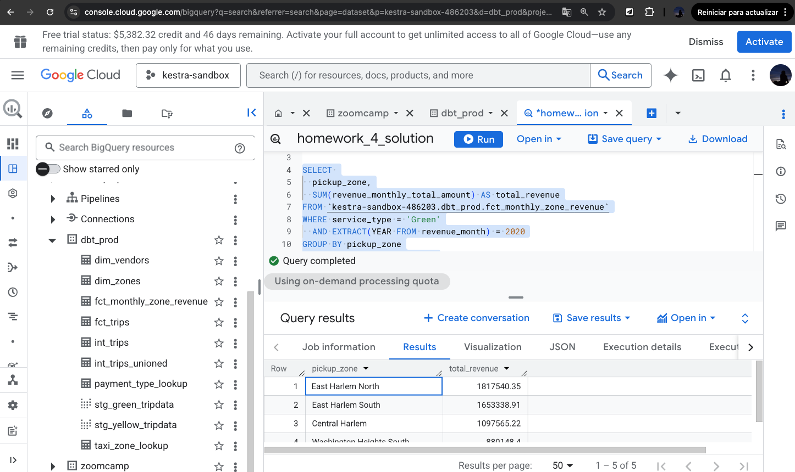

## Question 5. Green Taxi Trip Counts (October 2019)

Answer: **384624**

### Methodology
To find the total number of trips for Green taxis in October 2019, I queried the `fct_monthly_zone_revenue` table. 

Since this table is already aggregated at the zone and month level, I needed to calculate the sum of the `total_monthly_trips` column across all pickup zones. I applied filters strictly for the 'Green' `service_type` and the specific date timeframe (October 2019).

The following SQL query was executed:

```sql
SELECT 
  SUM(total_monthly_trips) AS total_trips
FROM `<your-gcp-project-id>.dbt_prod.fct_monthly_zone_revenue`
WHERE service_type = 'Green'
  AND EXTRACT(YEAR FROM revenue_month) = 2019
  AND EXTRACT(MONTH FROM revenue_month) = 10;
```

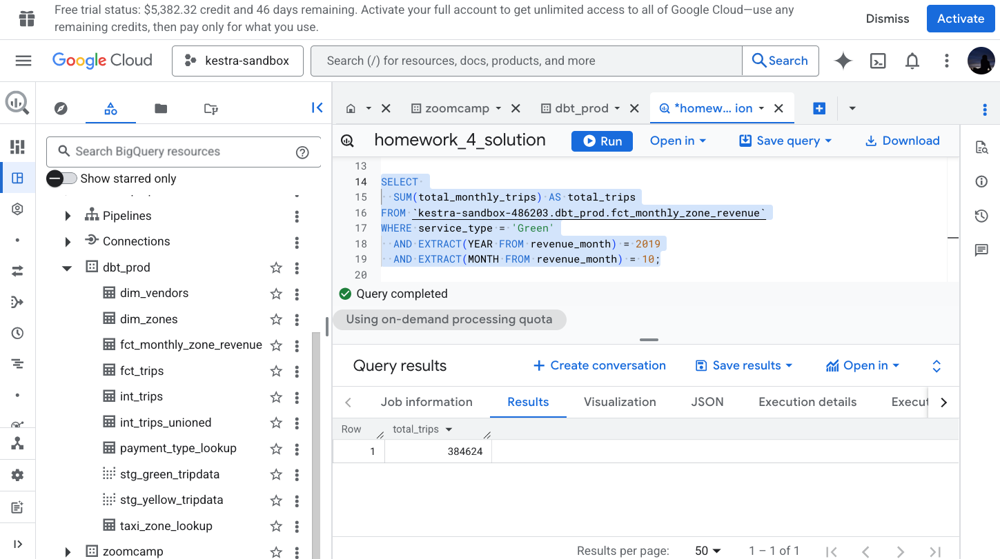

## Question 6. Build a Staging Model for FHV Data

Answer: **43,244,693**.

### Methodology

To answer this question, I integrated the 2019 For-Hire Vehicle (FHV) trip data into the existing dbt project and materialized a new staging model. The raw data was already loaded into the BigQuery `zoomcamp` dataset via the Kestra orchestration pipeline.

**Step 1: Updating Sources**

I appended the `fhv_tripdata` table to the `models/staging/sources.yml` file to make it recognizable to dbt.

```yaml
      - name: fhv_tripdata
        description: Raw FHV taxi trip records

```

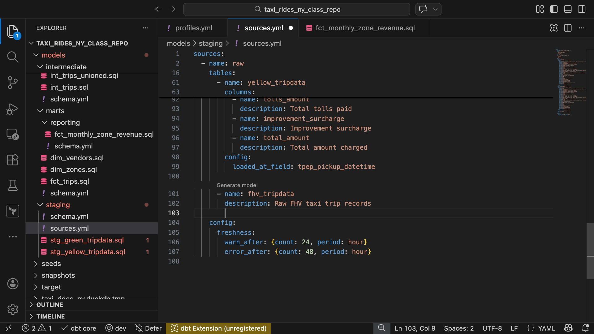

**Step 2: Creating the Staging Model**

I created a new SQL file named `stg_fhv_tripdata.sql` inside the `models/staging/` directory. The query casts timestamps, renames location IDs to follow project conventions, and filters out null dispatching base numbers.

```sql
{{ config(materialized='view') }}

select
    dispatching_base_num,
    cast(pickup_datetime as timestamp) as pickup_datetime,
    cast(dropoff_datetime as timestamp) as dropoff_datetime,
    cast(PULocationID as integer) as pickup_location_id,
    cast(DOLocationID as integer) as dropoff_location_id,
    SR_Flag as sr_flag,
    Affiliated_base_number as affiliated_base_number
from {{ source('raw', 'fhv_tripdata') }}
where dispatching_base_num is not null

```

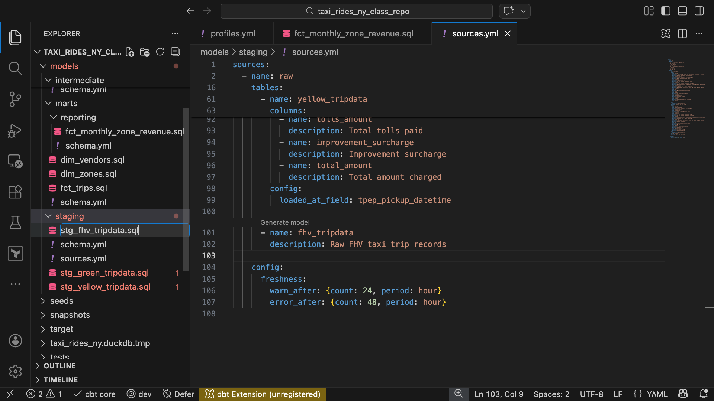

**Step 3: Building the Model**

To save compute resources and time, I executed a targeted dbt build command for just this specific model, disabling the testing limits. (Any false-positive caching errors from the VS Code dbt Extension were safely ignored).

```bash
dbt build --select stg_fhv_tripdata --target prod_cloud --vars '{is_test_run: false}'

```

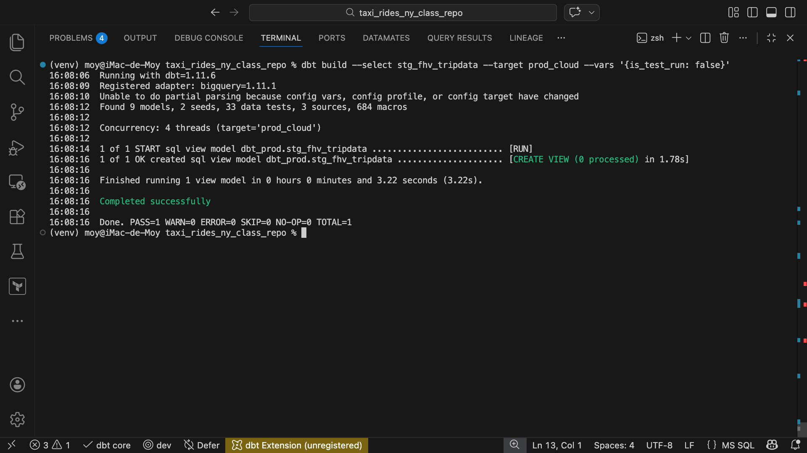

**Step 4: The Final Query**

After successfully materializing the view in the `dbt_prod` dataset, I ran the final count query directly in the BigQuery SQL workspace:

```sql
SELECT count(*)
FROM `<your-gcp-project-id>.dbt_prod.stg_fhv_tripdata`;

```

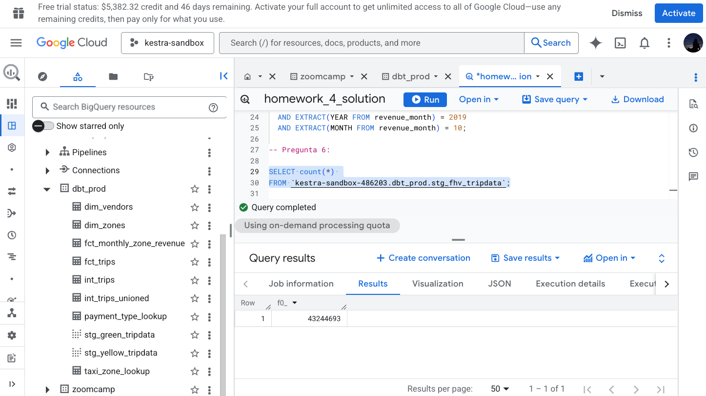

The query returned **43,244,693** records, confirming that the view was materialized correctly with the required filters applied.
