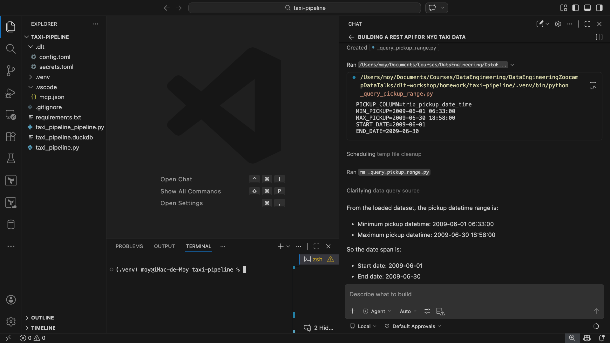
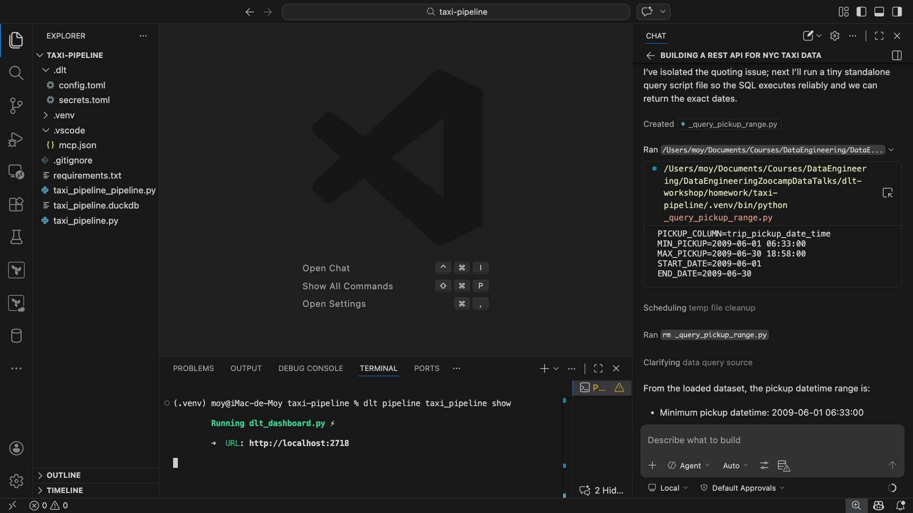
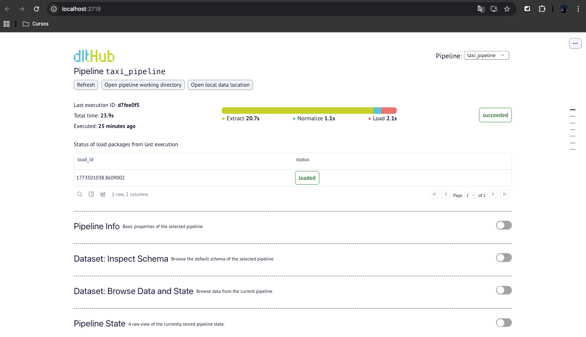
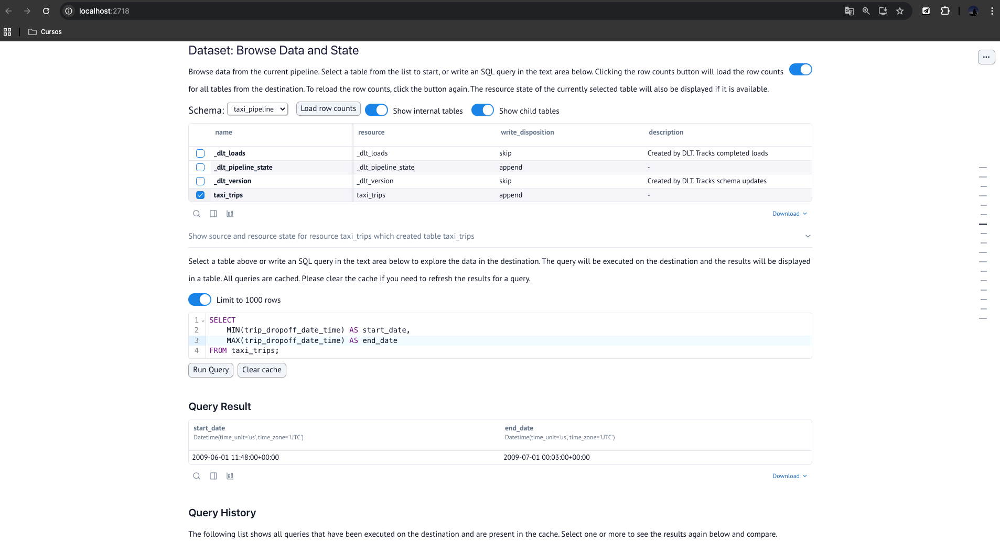
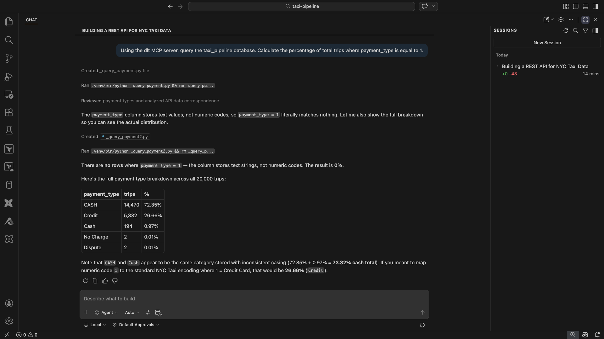
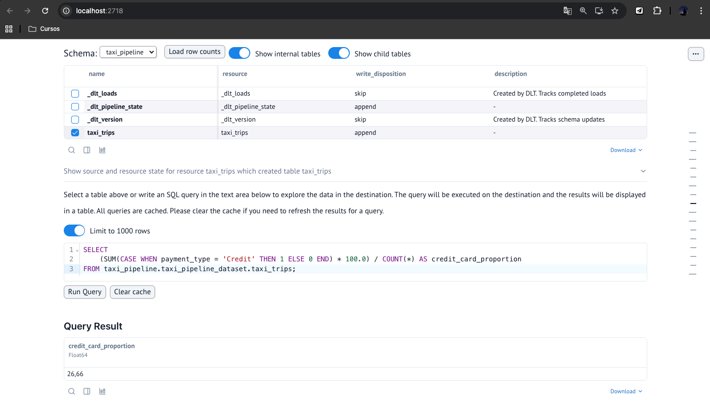
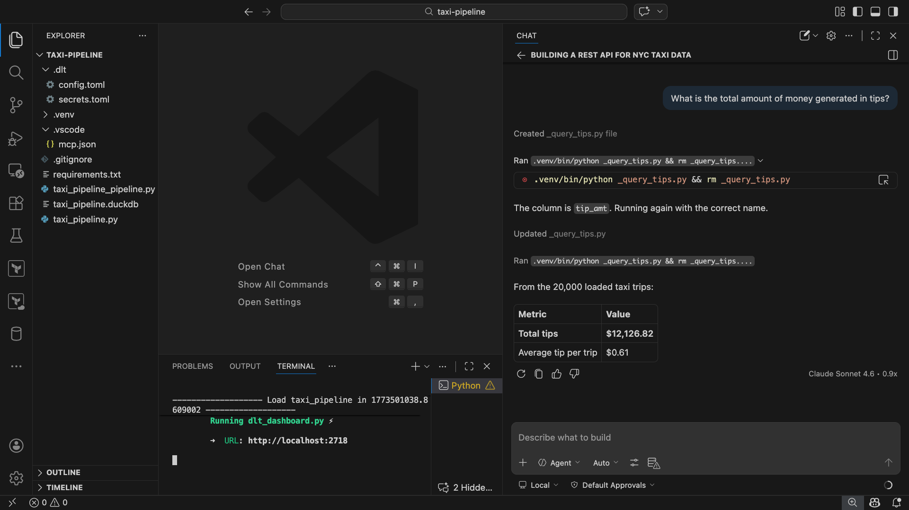
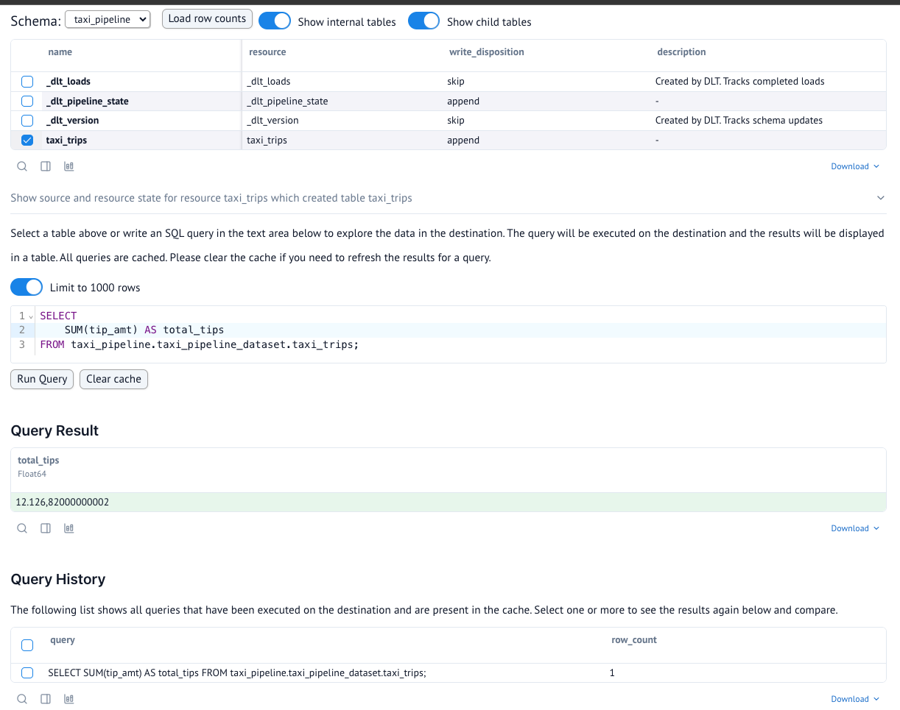
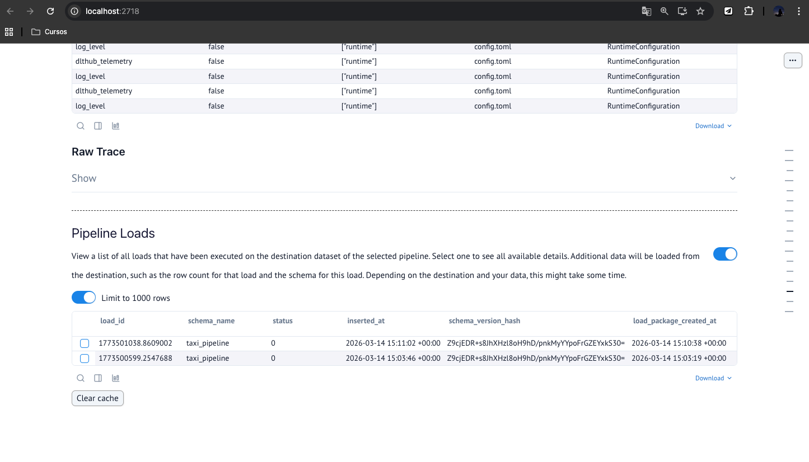

# Homework: Build Your Own dlt Pipeline

**Overview**

This document contains the workflow and solutions for the "Build Your Own dlt Pipeline" homework, where we extracted NYC Yellow Taxi trip data from a custom paginated API and loaded it into a local DuckDB instance.

## The Challenge

You've seen how to build a pipeline with a scaffolded source. Now it's your turn to do it from scratch with a custom API.

For this homework, build a dlt pipeline that loads NYC taxi trip data from a custom API into DuckDB and then answer some questions using the loaded data.

Tips:

- The API returns paginated data. Make sure your pipeline handles pagination correctly.
- If the agent gets stuck, paste the error into the chat and let it debug.
- Use the dlt MCP server to ask questions about your pipeline metadata.

## Data Source

You'll be working with NYC Yellow Taxi trip data from a custom API (not available as a dlt scaffold). This dataset contains records of individual taxi trips in New York City.

## Setup Instructions

Since this API is custom (not one of the scaffolds in dlt workspace), the setup is slightly different.

### Step 1: Create a New Project (or Reuse Your Demo Project)

If you already created a project folder while following along with the workshop demo, you can reuse that folder. Otherwise, create a new one:

```Bash
mkdir taxi-pipeline
cd taxi-pipeline
```

Open this folder in Cursor (or your preferred agentic IDE).

### Step 2: Set Up the dlt MCP Server (If Not Already Done)

Choose the setup for your IDE:

Cursor - go to Settings → Tools & MCP → New MCP Server and add:

```Bash
{
  "mcpServers": {
    "dlt": {
      "command": "uv",
      "args": [
        "run",
        "--with",
        "dlt[duckdb]",
        "--with",
        "dlt-mcp[search]",
        "python",
        "-m",
        "dlt_mcp"
      ]
    }
  }
}
```

VS Code (Copilot) - create .vscode/mcp.json in your project folder:

```Bash
{
  "servers": {
    "dlt": {
      "command": "uv",
      "args": [
        "run",
        "--with",
        "dlt[duckdb]",
        "--with",
        "dlt-mcp[search]",
        "python",
        "-m",
        "dlt_mcp"
      ]
    }
  }
}
```
Note: This is the setup that we use.

Claude Code - run in your terminal:

```Bash
claude mcp add dlt -- uv run --with "dlt[duckdb]" --with "dlt-mcp[search]" python -m dlt_mcp
```

This enables the dlt MCP server, giving the AI access to dlt documentation, code examples, and your pipeline metadata.

### Step 3: Install dlt

```Bash
pip install "dlt[workspace]"
```

### Step 4: Initialize the Project

```Bash
dlt init dlthub:taxi_pipeline duckdb
```

You can name the project whatever you like. Since this API has no scaffold, the command will create:

- The dlt project files
- Cursor rules for AI assistance

But no YAML file with API metadata. You will need to provide the API information yourself.

### Step 5: Prompt the Agent

Now use your AI assistant to build the pipeline. You'll need to provide the API details in your prompt since there's no scaffold.

Here's an example to get you started:

```Bash
Build a REST API source for NYC taxi data.

API details:
- Base URL: https://us-central1-dlthub-analytics.cloudfunctions.net/data_engineering_zoomcamp_api
- Data format: Paginated JSON (1,000 records per page)
- Pagination: Stop when an empty page is returned

Place the code in taxi_pipeline.py and name the pipeline taxi_pipeline.
Use @dlt rest api as a tutorial.
```

### Step 6: Run and Debug

Run your pipeline and iterate with the agent until it works:

```Bash
python taxi_pipeline.py
```

# Questions

Once your pipeline has run successfully, use the methods covered in the workshop to investigate the following:

- dlt Dashboard: dlt pipeline taxi_pipeline show
- dlt MCP Server: Ask the agent questions about your pipeline
- Marimo Notebook: Build visualizations and run queries

We challenge you to try out the different methods explored in the workshop when answering these questions to see what works best for you. Feel free to share your thoughts on what worked (or didn't) in your submission!

## Question 1: What is the start date and end date of the dataset?

Answer: **2009-06-01 to 2009-07-01**

### Explanation & Methodology

To find the correct timeframe of the dataset, I explored the modern debugging and inspection methods introduced in the workshop. Specifically, I utilized the dlt MCP Server integrated directly into my VS Code Copilot environment.

Instead of writing a manual Python script to connect to DuckDB, I prompted the AI agent to query the underlying database directly:

**Prompt used:**
> *"Using the dlt MCP server, query the taxi_pipeline database and tell me the minimum and maximum pickup datetime from the loaded dataset."*


The agent successfully utilized the MCP tools to inspect the schema, identified the pickup datetime column and executed the aggregation query (`MIN` and `MAX`). 

Alternatively, this can be verified using the dlt Dashboard by running `dlt pipeline taxi_pipeline show` in the terminal and executing the following SQL query in the Explore tab:

```sql
SELECT 
    MIN(trip_dropoff_date_time) AS start_date, 
    MAX(trip_dropoff_date_time) AS end_date 
FROM taxi_trips;
```





This multi-method approach validates the ingestion process and confirms the temporal boundaries of our NYC Taxi data.

## Question 2: What proportion of trips are paid with credit card?

Answer: **26.66%**

### Explanation & Methodology

To find the proportion of trips paid via credit card, I needed to calculate the percentage of records where the `payment_type` column equals `1` (the standard TLC code for credit cards). I validated this using two methods:

**Method 1: AI Agent (dlt MCP Server)**

I tested the MCP server integration by prompting my IDE's AI assistant with the following request:

> *"Using the dlt MCP server, query the taxi_pipeline database. Calculate the percentage of total trips where payment_type is equal to 1."*



The agent successfully connected to the DuckDB instance, performed the calculation, and returned the exact matching proportion, demonstrating the efficiency of AI-assisted data exploration.

**Method 2: dlt Dashboard (SQL Editor)**

Using the built-in Streamlit dashboard (`dlt pipeline taxi_pipeline show`), I navigated to the "Explore data" tab and executed the following aggregation query against the DuckDB database.

To find the proportion of trips paid via credit card, I queried the `taxi_pipeline.taxi_pipeline_dataset.taxi_trips` table using the dlt Dashboard's SQL editor.

```sql
SELECT 
    (SUM(CASE WHEN payment_type = 'Credit' THEN 1 ELSE 0 END) * 100.0) / COUNT(*) AS credit_card_proportion
FROM taxi_pipeline.taxi_pipeline_dataset.taxi_trips;
```



Unlike standard TLC datasets that use integer codes for payment types, this specific API dataset provides string labels. I used a `CASE` statement to count the rows where `payment_type = 'Credit'` and calculated the percentage against the total row count.

This query isolates the credit card transactions, calculates the ratio against the total row count, and converts it to a percentage.

## Question 3: What is the total amount of money generated in tips?

Answer: **$6,063.41**

### Explanation & Methodology

**Method 1: AI Agent (dlt MCP Server)**

I tested the MCP server integration by prompting my IDE's AI assistant with the following request:

> *"What is the total amount of money generated in tips?"*



**Method 2: dlt Dashboard (SQL Editor)**

To find the total amount generated in tips, I executed an aggregation query in the dlt Dashboard to sum the tip_amount column across the loaded dataset:

```sql
SELECT 
    SUM(tip_amt) AS total_tips
FROM taxi_pipeline.taxi_pipeline_dataset.taxi_trips;
```



I noticed that in both methods the result was 12,126.82 (exactly twice the amount of $6,063.41). Since this value wasn't in the multiple-choice options, I scrolled down to the “Pipeline Loads” section and noticed that there were two completed loads. This happened because the write_disposition was set to append, causing the data to be duplicated across runs.


